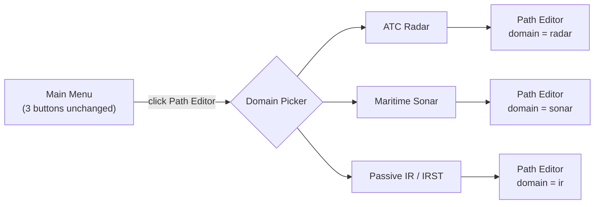

# ADR-001 — Sensor-Modality Domains in the Path Editor

**Status:** Proposed (exploration on side branch, post-v3.7.0)
**Date:** 2026-05-31
**Owner:** Team Adeptus

> Internal design note. Keep it **out of `docs/`** — `build_installer` ships `docs/` wholesale into the end-user installer. `design/` is not shipped.

---

## 1. Context

TrackBench supports three sensor modalities that behave like fundamentally different problem domains:

| Modality | Class | Measurement | World |
|---|---|---|---|
| **Radar** | `fusionRadarSensor` | active range + bearing | aircraft **above** ground, altitude-up, terrain/weather |
| **Sonar** | `sonarSensor` | active range + bearing | contacts **below** the surface, depth-down, up/down elevation ambiguity |
| **IR** | `irSensor` | passive **angle-only** (no range) | air targets, angle space, needs a range-parameterized filter |

The Path Editor — its rendering, defaults, sensor palette, and coverage views — implicitly assumes the **radar** world: altitude-up axes, terrain, aircraft trajectories, Cartesian coverage volumes. Building sonar or IR scenarios through it is awkward (the result views were unhelpful and the defaults wrong), which motivated this note.

## 2. Decision

Introduce a **scenario domain** chosen when the user opens the Path Editor. The three top-level menu buttons stay the same; clicking **Path Editor** first presents a **domain picker** (ATC Radar / Maritime Sonar / Passive IR), then opens the editor in that domain.

**One Path Editor parameterized by a `domain` descriptor — not three separate editors.** Three editors would triplicate a large, finicky GUI and its maintenance. A single editor that reads a descriptor and swaps the modality-specific pieces is the maintainable choice and matches the "buttons unchanged, picker on click" flow.



## 3. The `domain` descriptor (the core abstraction)

A single struct is the **one source of truth** for everything that varies by modality. Every editor branch reads from it instead of scattering `if isSonar …` checks across the rendering and UI code.

```matlab
% trackbench.editor.sensorDomain("sonar") returns:
domain = struct( ...
  'key',           "sonar", ...                                   % radar | sonar | ir
  'label',         "Maritime Sonar", ...
  'sensorTypes',   {{'ACTIVE_SONAR','PASSIVE_SONAR','TOWED_ARRAY'}}, ... % palette filter
  'vertical',      struct('label',"Depth (m, +down)",'zdir',"reverse",'sign',+1), ...
  'environment',   "bathymetry", ...                              % terrain | bathymetry | atmosphere
  'targetPresets', {{'submarine_slow','submarine_deep'}}, ...
  'defaultTarget', "submarine_slow", ...
  'resultView',    @trackbench.reporting.plotByModality, ...      % the modality result view
  'coverageStyle', "depth", ...
  'defaultTracker',"GNN/sonar_GNN");
```

The descriptor lives in one factory (`trackbench.editor.sensorDomain(key)`); the editor and the run pipeline both consume it.

## 4. Per-domain tailoring

| | ATC Radar | Maritime Sonar | Passive IR / IRST |
|---|---|---|---|
| Sensor palette | PSR, SSR, PAR, ASR, ARSR | ACTIVE / PASSIVE / TOWED sonar | IRST, FLIR |
| Vertical axis | Altitude (up) | Depth (down) | angle space |
| Environment | terrain + weather | bathymetry / thermocline | atmosphere |
| Targets | aircraft | submarines | air targets |
| Result view | 3D theaterPlot | depth-down 3D | az/el seeker |
| Default tracker | autotuned / default_GNN | `sonar_GNN` (IMM, init 60) | `test_IRST_GNN` + auto angle-only filter |

**IR framing:** label the domain by **function** (passive angle-only), not platform. The code models IRST on a ground "tower" today, but IRST is classically airborne or shipborne — make platform a choice *inside* the IR domain. That sidesteps the "is it airborne?" question entirely.

## 5. Hard rules (these are what keep debugging low)

1. **Radar domain stays byte-identical.** All new behavior is gated so it only runs for sonar/IR; the existing radar editor path must not change. No regressions to hunt. (Same gating that kept the radar detection pipeline bit-identical when sonar was added — radar PAR_TEST stayed 319 scans / 320 detections.)
2. **One descriptor, no scattered conditionals.** If you catch yourself writing `if domain=="sonar"` inside rendering code, push that fact into the descriptor instead.
3. **Phase the risk:** config/defaults first, the rendering retrofit last and isolated.

## 6. Phasing (safe → risky)

**Phase 0 — this note.** Lock the descriptor + the hard rules.

**Phase 1 — picker + per-domain defaults (low risk).**
- A small modal `selectDomain()` launched from the Path Editor button; returns a domain key.
- `pathEditor(domainKey)` loads the descriptor and applies: sensor-palette filter, default environment, starter target, axis label/orientation, and the result-view hook.
- **No rendering-engine changes yet** — radar-style drawing still used, just re-labeled/re-oriented where trivial.
- Ships real value on its own (correct defaults + the right result view) and is quick to eyeball; radar path untouched.

**Phase 2 — depth-down rendering retrofit (the lift).**
- Generalize the editor's drawing to honor `domain.vertical` (axis direction, sign, labels) so sonar renders depth-down natively; bathymetry environment for sonar.
- This is the **bug-prone part**: the editor's drawing assumes altitude-up, the GUI has historically been finicky (2D-squish, uifigure quirks, the undo contract), and it **can't be verified headlessly** (automation can't see the live GUI). Do it isolated, behind the domain flag, with a human visual check at each step.

**Phase 3 (later).** Richer environment models (thermocline for sonar, atmospheric attenuation for IR); per-domain target-preset libraries.

## 7. Risks & mitigations

| Risk | Mitigation |
|---|---|
| GUI regressions in a finicky editor | radar byte-identical gate; small phases; visual check each step |
| Headless-test gap (automation can't see the GUI) | each phase needs a human visual pass; small phases isolate which change broke a view |
| Coordinate-frame bugs (the classic source) | centralize all up/down/sign logic in `domain.vertical`; never hardcode altitude-up in drawing |
| Scope creep | Phase 1 ships value without the rendering retrofit |

## 8. Open questions

- **Run Simulation GUI:** does it need the same domain gate, or just infer the domain from the loaded scenario's sensors? Almost certainly the latter — `runSingleScenario` already does this via `detectPrimaryModality`; reuse it.
- **Picker UX:** separate modal vs. a first "page" inside the editor window that transitions (user leaned toward the transition).
- **Mixed-modality scenarios** (radar + sonar in one run): out of scope for v1 — the domain is single-select.
